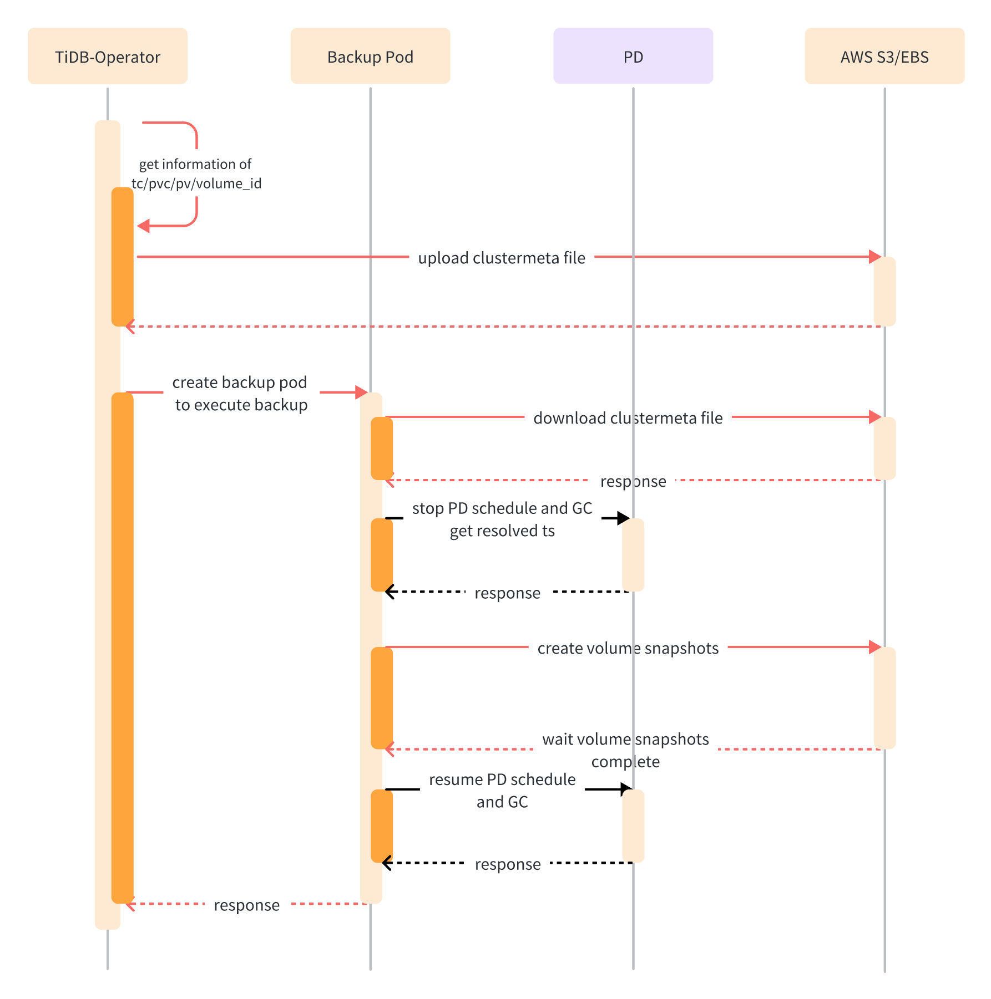

<h1>EBS Backup Restore Federation</h1>

<h2>Background</h2>

Some TiDB operator users need to deploy TiDB across multiple Kubernetes clusters. Each Kubernetes cluster will be deployed in a single AZ, and each Kubernetes can only manage the AWS resources in that AZ. However, EBS backup and restoration requires the operation of volumes and snapshots in different AZs. Therefore, a federated solution needs to be provided to users to coordinate backup/restore of volumes in their respective AZs across multiple Kubernetes clusters.

The key constraint is that operations involving AWS and Kubernetes resources can only be done within each Kubernetes, but TiDB components are interconnected across each Kubernetes, so TiDB-related operations are not limited by Kubernetes. Therefore, we need to categorize the EBS backup and restore process, distinguishing which processes can be done in only one Kubernetes, and which processes need to be done in each Kubernetes.

<h3>Current Implementation</h3>

In the diagrams below, the red lines represent AWS and Kubernetes related operations that need to be executed separately in each Kubernetes cluster, while the black lines represent TiDB related operations that can be executed in any Kubernetes cluster.

<h4>Backup</h4>



<h4>Restore</h4>


<h2>Scope and prerequisites</h2>

Goal for 6/30:

Support our current 3 az/k8s cluster setup with a TiDB cluster in each az/k8s cluster. Such that we restore into the same AZs in the same region.

Scope and assumptions:

1. EBS backup and restore support in the federated cluster includes all functions of those in the single Kubernetes cluster, including creating backups, deleting backups, automatic backup scheduling using backup schedules, automatic backup cleanup based on retention policies, and cluster restore functions.
2. Only multiple Kubernetes clusters deployed in different AZs within a single region are supported for federation, and cross-region federation is not supported.
3. Only EBS snapshot backup and restore is supported, and other types of backup and restore or TiDB-Operator's other features are not supported.
4. The federated cluster architecture for backup and restore must be consistent, that is, the number of AZs, Kubernetes clusters, and TiKV replicas for each Kubernetes cluster must be the same, but the number of TiDB/PD instances can be different.
5. EBS snapshot restore only supports restoring to volumes in the same region, with the same volume type.

Longer term(beyond 2023):

1. Cross-region federation of Kubernetes clusters deployed in different AZs across multiple AWS regions will be supported.
2. The federated cluster architecture for backup and restore must be consistent, that is, the number of AZs, Kubernetes clusters, and TiKV replicas for each Kubernetes cluster must be the same, but the number of TiDB/PD instances can be different. **_The number of TiKV nodes shall be the same between the backuped and restored clusters, however, the TiKV nodes in the restored cluster might have less CPU and memory._**
3. EBS snapshot restore will support restoring to volumes in a different region with different volume types.
4. EBS snapshot backup and restore will support backup and restoring from and to different k8s clusters with each k8s cluster under different AWS accounts.

<h2>Architecture Design</h2>


<h2>Detailed Design</h2>

<h3>BR Federation Manager</h3>

The user needs to install BR Federation Manager into the control plane Kubernetes cluster, and ensure that BR Federation Manager can connect to the api-servers of each data plane Kubernetes clusters on the network.

The BR Federation Manager should cooperate tidb-operators in the data plane by Kubernetes API server. We only need to **get/create/update/delete** permissions on `Backup`/`Restore` CR to the users of the federation operator.

<h3>Kubeconfig</h3>

1. The user prepares the kubeconfig of all data plane Kubernetes clusters to one file.
2. The use encodes the kubeconfig file and configures it to a secret.

```yaml
apiVersion: v1
kind: Secret
metadata:
  name: br-federation-kubeconfig
type: Opaque
data:
  kubeconfig: ${encoded-kubeconfig}
```

<h3>Backup</h3>

In the BR Federation Manager, a new CRD, `VolumeBackup`, will be created. The user needs to specify the kubeconfig and `TiDBCluster` information for each Kubernetes cluster so that the control plane can coordinate the backup of TiKV volumes for each Kubernetes cluster.

```yaml
apiVersion: federation.pingcap.com/v1alpha1
kind: VolumeBackup
metadata:
  name: bk-federation
  namespace: default
spec:
  clusterList:
  - k8sClusterName: cluster-1
    tcName: tc-1
    tcNamespace: ns1
  - k8sClusterName: cluster-2
    tcName: tc-2
    tcNamespace: ns2
  - k8sClusterName: cluster-3
    tcName: tc-3
    tcNamespace: ns3
  template:
    s3:
      bucket: bucket1
      region: region1
      prefix: prefix1
      secretName: secret1
    toolImage: br-image
    serviceAccount: sa1
    cleanPolicy: Delete
```

<h4>Backup Process</h4>

During EBS backup, as EBS snapshot is an asynchronous and time-consuming operation, to ensure data safety, we need to first stop PD scheduling and maintain GC safe point less than resolved ts before taking the EBS snapshot. In a multi-Kubernetes cluster scenario, as EBS snapshot needs to be taken in each Kubernetes cluster, this operation becomes a distributed operation. Therefore, we need to ensure that PD scheduling and GC are stopped before taking EBS snapshot in each Kubernetes cluster, and PD scheduling and GC are resumed only after EBS snapshot is taken in all Kubernetes clusters. Therefore, we divide the EBS backup process into three phases.


**First phase:**

1. The backup controller of the control plane randomly selects a data plane Kubernetes cluster and creates a `Backup` CR with `federalVolumeBackupPhase: initialize`.
2. The backup controller of the corresponding data plane Kubernetes cluster first creates backup pod1 to obtain the resolved ts and maintain the GC safepoint not exceeding the resolved ts and stop PD scheduling.
3. After stopping GC and PD scheduling, backup CR enters the `VolumeBackupInitialized` state.

**Second phase:**

4. The backup controller of the control plane discovers that backup CR is in `VolumeBackupInitialized` state, then sets `federalVolumeBackupPhase` of `Backup` CR to `execute` and creates `Backup` CRs for other data plane Kubernetes clusters with `federalVolumeBackupPhase: execute`.
5. The backup controller of the data plane collects information about TC and records it in the clustermeta file, creates backup pod2, and executes EBS backup.
6. After the EBS backup is completed, `Backup` CRs enter the `VolumeBackupComplete` state.

**Third phase:**

7. The backup controller of the control plane discovers that all `Backup` CRs are in `VolumeBackupComplete` state. At this time, all data planes have completed effective backups (if the condition is not met, the backup enters the failed state).
8. The backup controller of the control plane sets `federalVolumeBackupPhase` of the `Backup` CR in step1 to `teardown`, the backup controller of the corresponding data plane Kubernetes cluster deletes backup pod1 is deleted to stop maintaining the GC safepoint and resume PD scheduling. The EBS backup is completed.


<h4>Delete Backup</h4>

When the `VolumeBackup` CR is deleted, the backup controller in the control plane will delete all corresponding `Backup` CRs in the data plane. After all Backups have been deleted, `VolumeBackup` will be deleted completely.

<h3>BackupSchedule</h3>

In the BR Federation Manager, a new CRD, `VolumeBackupSchedule`, will be created to support automatic scheduling of backups and regular cleanup of backups based on `maxReservedTime`. Its implementation is similar to `BackupSchedule` and will automatically create and delete `VolumeBackup` CRs based on the configuration.

```yaml
apiVersion: pingcap.com/v1alpha1
kind: VolumeBackupSchedule
metadata:
  name: bks-federation
  namespace: default
spec:
  schedule: 0 0 1 * * ?
  pause: false
  maxReservedTime: 7d
  backupTemplate: {{spec of VolumeBackup}}
```

<h3>Restore</h3>

In the BR Federation Manager, a new CRD, `VolumeRestore`, will be created. The user needs to specify the kubeconfig, tc, and backup storage path information for each Kubernetes cluster, and it is necessary to ensure that Kubernetes and backups are in the same AZ.

```yaml
apiVersion: federation.pingcap.com/v1alpha1
kind: VolumeRestore
metadata:
  name: rt-federation
  namespace: default
spec:
  clusterList:
  - k8sClusterName: cluster-1
    tcName: tc-1
    tcNamespace: ns1
    azName: az4
    backup:
      s3:
        provider: aws
        region: us-west-2
        bucket: bucket-name
        prefix: tc-1-bk-federation-az1
  - k8sClusterName: cluster-2
    tcName: tc-2
    tcNamespace: ns2
    azName: az5
    backup:
      s3:
        provider: aws
        region: us-west-2
        bucket: bucket-name
        prefix: tc-2-bk-federation-az2
  - k8sClusterName: cluster-3
    tcName: tc-3
    tcNamespace: ns3
    azName: az6
    backup:
      s3:
        provider: aws
        region: us-west-2
        bucket: bucket-name
        prefix: tc-3-bk-federation-az3
  template:
    toolImage: br-image
    serviceAccount: sa1
```

<h4>Restore Process</h4>

The restore process was originally divided into two phases, where the first phase involved restoring the TiKV volumes and the second phase involved restoring TiKV data to the resolved ts state. The first phase needs to be executed in each Kubernetes cluster, while the second phase only needs to be executed in a single Kubernetes cluster. However, there is a follow-up task after the second phase, which involves restarting TiKV pods and setting TC recoveryMode to false. This task needs to be executed in each Kubernetes cluster, so we divide the restore process into three phases.


**Before restoration:**

1. Users create `TiDBCluster` CR in each data plane Kubernetes cluster and set the `recoveryMode` of all `TiDBCluster` CR to `true`, and also ensure that the TiKV replicas in each AZ are consistent with the backup.

**First phase:**

2. The restore controller of the control plane creates `Restore` CRs in each Kubernetes cluster with `federalVolumeRestorePhase: restore-volume`.
3. The restore controller of the data plane restores the volumes from EBS snapshots, correctly assigns each volume to each TiKV, and starts TiKV.
4. When the restore controller of the data plane discovers that all TiKV nodes in the current Kubernetes cluster have been successfully started, the restore CR1 enters the `TikvComplete` state.

**Second phase:**

5. The restore controller of the control plane randomly selects a Kubernetes cluster to set `federalVolumeRestorePhase` of `Restore` CR to `restore-data` after all `Restore` CRs have entered `TikvComplete` state (if any restore CR fails, the restore fails).
6. The restore controller of the data plane creates a restore pod, and performs the data restore stage of EBS restore. When BR completes execution, the `Restore` CR enters `DataComplete` state.

**Third phase:**

7. The restore controller of the control plane updates the `federalVolumeRestorePhase` of all restore CRs to `restore-finish` after the `Restore` CR in step5 enters the `DataComplete` state.
8. The restore controller of the data plane restarts the TiKV pods in the Kubernetes cluster where it is located, sets TC `recoveryMode` to `false`. Then the `Restore` CR enters `Complete` state.
9. The restore is completed when the restore controller of the control plane discovers that all `Restore` CRs have entered `Complete` state.


