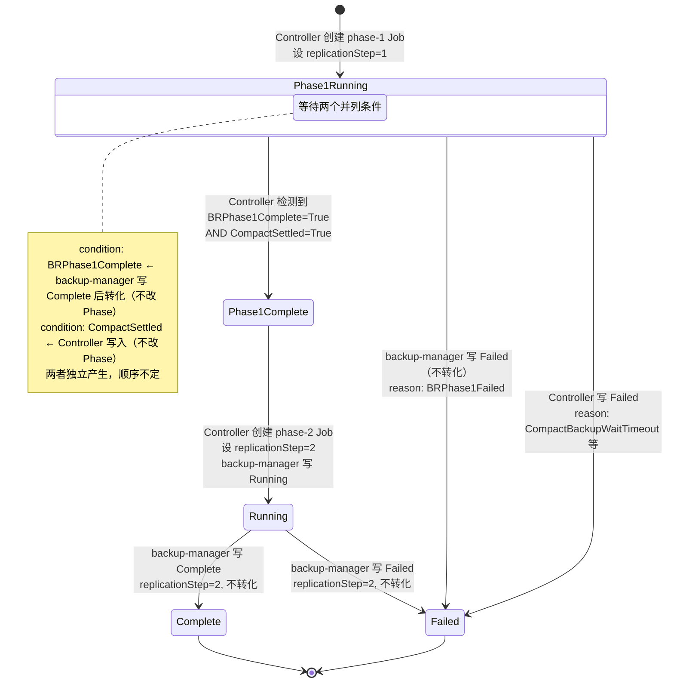

# Replication Restore: 状态模型设计

本文档是 [replication-restore-v2](2026-04-15-replication-restore-v2.md) 的补充设计，解决 review 中提出的状态写入权、Phase 模型、双 Job 对象模型、CompactBackup 绑定契约等前置问题。

## 1. 状态写入权

### 现有模式

当前 Restore 的状态写入由 controller 和 backup-manager 分担：

- **Controller**：写 `Scheduled`、`Invalid`、`RetryFailed` 等调度阶段状态
- **backup-manager**：写 `Running`、`Complete`、`Failed` 等执行阶段状态
- 两者共用同一个 `RestoreConditionUpdaterInterface.Update()` 方法

### Replication mode 的挑战

Replication mode 有两个 BR Job（phase-1 和 phase-2），中间还有门控等待。如果 backup-manager phase-1 写 `Complete`，controller 会认为整个 Restore 已完成并 skip。

### 解决方案：基于 ReplicationStep 的状态转化

在 `RestoreStatus` 中新增 `replicationStep` 字段，由 controller 在每个阶段开始时设置。`UpdateRestoreCondition()` 在写入 condition 前根据该字段做转化。

**RestoreStatus 新增字段**：

```go
type RestoreStatus struct {
    // ... 现有字段 ...

    // ReplicationStep 标记当前 replication restore 的阶段。
    // 仅 mode=replication 时有效。
    // 值为 1 时，backup-manager 写入的 Complete 会被转化为 BRPhase1Complete（condition 标记）。
    // 值为 2 时，不做转化，行为与现有 mode 一致。
    // 由 controller 在创建每个阶段的 Job 时设置。
    // +optional
    ReplicationStep int32 `json:"replicationStep,omitempty"`
}
```

### 转化规则

**`UpdateRestoreCondition()` 新增转化逻辑——只转化 `Complete`，不转化 `Failed`**。

> **关键变更**：现有实现（`restore.go`）在函数入口处无条件执行 `status.Phase = condition.Type`。新代码将此赋值移到 Condition 标记（BRPhase1Complete / CompactSettled）的 early-return **之后**，确保标记类 condition 不改变 Phase。

```go
func UpdateRestoreCondition(status *RestoreStatus, condition *RestoreCondition) bool {
    if condition == nil {
        return false
    }
    condition.LastTransitionTime = metav1.Now()

    // Replication mode phase-1 转化：仅转化 Complete
    // - Complete 必须转化：否则 controller 会认为整个 Restore 已完成
    // - Failed 不转化：无论 backup-manager 还是 controller 写 Failed，都是整体终态
    //   通过 Reason 字段区分失败原因（BRPhase1Failed / CompactBackupWaitTimeout 等）
    if status.ReplicationStep == 1 && condition.Type == RestoreComplete {
        condition.Type = RestoreBRPhase1Complete
    }

    // Condition 标记（BRPhase1Complete / CompactSettled）：只记录，不驱动 Phase 变化
    if condition.Type == RestoreBRPhase1Complete || condition.Type == RestoreCompactSettled {
        conditionIndex, oldCondition := GetRestoreCondition(status, condition.Type)
        if oldCondition == nil {
            status.Conditions = append(status.Conditions, *condition)
            return true
        }
        status.Conditions[conditionIndex] = *condition
        return true
    }

    // Phase 值：正常流程，驱动 Phase 变化
    status.Phase = condition.Type
    // ... 后续现有逻辑不变
}
```

**新增 RestoreConditionType**：

```go
const (
    // Phase 值（互斥，驱动 status.phase 变化）
    RestorePhase1Running   RestoreConditionType = "Phase1Running"   // 阶段 1 进行中
    RestorePhase1Complete  RestoreConditionType = "Phase1Complete"  // 门控通过

    // Condition 标记（并列，仅记录在 conditions 列表中，不改变 Phase）
    RestoreBRPhase1Complete RestoreConditionType = "BRPhase1Complete"  // BR phase-1 成功
    RestoreCompactSettled   RestoreConditionType = "CompactSettled"    // CompactBackup 到达终态
)
```

关键区分：
- **Phase 值**（`Phase1Running`、`Phase1Complete`、`Running`、`Complete`、`Failed`）：互斥，写入时驱动 `status.phase` 变化
- **Condition 标记**（`BRPhase1Complete`、`CompactSettled`）：并列条件，仅记录在 conditions 列表中，**不改变 Phase**。Controller 检查这两个标记是否同时存在来判断门控

### 为什么 Failed 不转化

转化层只转化 `Complete`，不转化 `Failed`，原因：

1. **避免误转 controller 自己写的 Failed**：controller 和 backup-manager 共用同一个 updater。如果转化 Failed，controller 因超时/校验错误写的 `RestoreFailed` 也会被误转为 `BRPhase1Failed`，语义会乱
2. **BR phase-1 失败 = 整体失败**：BR phase-1 失败没有恢复路径，直接终止 Restore 是正确行为
3. **通过 Reason 区分失败原因**：不需要单独的 Phase 值，`Failed` + 不同 Reason 足够

所有失败场景的处理：

| 失败场景 | 谁写 | Condition | Reason | Restore 终态 |
|----------|------|-----------|--------|:---:|
| BR phase-1 Job 失败 | backup-manager | `Failed`（不转化） | `BRPhase1Failed` | Failed |
| BR phase-2 Job 失败 | backup-manager | `Failed`（step=2 不转化） | `BRPhase2Failed` | Failed |
| CompactBackup 全部/部分 shard 失败 | controller handler | `CompactSettled`（标记） | `ShardsPartialFailed` | **继续 → phase-2** |
| CompactBackup 等待超时（不存在） | controller handler | `Failed` | `CompactBackupWaitTimeout` | Failed |
| 跨 CR 校验不一致 | controller handler | `Failed` | `CompactBackupMismatch` | Failed |

### Phase 流转



### 门控判定

Controller 在每次 reconcile 时检查两个并列条件：

```go
hasBRDone := hasCondition(restore, RestoreBRPhase1Complete, corev1.ConditionTrue)
hasCompactDone := hasCondition(restore, RestoreCompactSettled, corev1.ConditionTrue)

if hasBRDone && hasCompactDone {
    // 门控通过，设置 Phase1Complete，然后创建 phase-2 Job
    statusUpdater.Update(restore, &RestoreCondition{
        Type: RestorePhase1Complete, Status: corev1.ConditionTrue,
    }, nil)
}
```

两个条件的到达顺序不影响结果：
- 先 BR 完成后 Compact 完成 → 第二个到达时门控通过
- 先 Compact 完成后 BR 完成 → 第二个到达时门控通过
- 两者都未完成 → Phase 保持 `Phase1Running`，等待

### 写入权分工

| 字段 / Condition | 写入者 | 是否改变 Phase |
|------------------|--------|:--------------:|
| `status.replicationStep` | Controller | — |
| `Phase1Running` | Controller | 是 |
| `BRPhase1Complete` (标记) | backup-manager 写 Complete → 转化 | **否** |
| `CompactSettled` (标记) | Controller | **否** |
| `Phase1Complete` | Controller（门控通过时） | 是 |
| `Running` (phase-2) | backup-manager | 是 |
| `Complete` | backup-manager | 是 |
| `Failed` | backup-manager / Controller | 是（不转化） |

**结果**：backup-manager 零改动。转化逻辑集中在 `UpdateRestoreCondition()` 一个函数中，只做一件事：`replicationStep=1 时 Complete → BRPhase1Complete`。

---

## 2. 双 Job 对象模型

### 现有模型

`GetRestoreJobName()` 只返回一个 Job 名，`isRestoreJobFailed()` 只检查一个 Job。Replication mode 有两个 BR Job，需要扩展对象模型。

### Job 标识：Label + 命名

代码中通过 **label 查询** Job，命名规则作为人类可读的辅助标识。

**新增 Label 常量**：

```go
const (
    // ReplicationStepLabelKey 标识 Job 属于 replication restore 的哪个阶段
    ReplicationStepLabelKey = "tidb.pingcap.com/replication-step"

    // Component label 值
    RestorePhase1JobLabelVal = "restore-phase1"
    RestorePhase2JobLabelVal = "restore-phase2"
)
```

**每个 Job 上的 labels**：

| Label | phase-1 Job | phase-2 Job | 来源 |
|-------|-------------|-------------|------|
| `app.kubernetes.io/name` | `restore` | `restore` | 现有 |
| `app.kubernetes.io/component` | `restore-phase1` | `restore-phase2` | 新增 |
| `app.kubernetes.io/managed-by` | `restore-operator` | `restore-operator` | 现有 |
| `tidb.pingcap.com/restore` | `{name}` | `{name}` | 现有 |
| `tidb.pingcap.com/replication-step` | `"1"` | `"2"` | 新增 |

**Job 命名规则**（辅助标识，代码中不依赖拼名字查询）：

| Job | 名称 | 创建时机 |
|-----|------|----------|
| BR phase-1 | `{name}-phase1` | 进入阶段 1 时 |
| BR phase-2 | `{name}-phase2` | 门控通过后 |

两个 Job 都以 Restore CR 为 OwnerReference。

### Job 查询方式

通过 label selector 查询，不依赖名字拼接：

```go
func (h *replicationHandler) getJobForStep(restore *Restore, step int) (*batchv1.Job, error) {
    sel := labels.Set{
        label.RestoreLabelKey:         restore.Name,
        label.ReplicationStepLabelKey: strconv.Itoa(step),
    }.AsSelector()

    jobs, err := h.deps.JobLister.Jobs(restore.Namespace).List(sel)
    if err != nil || len(jobs) == 0 {
        return nil, err
    }
    return jobs[0], nil
}
```

### Handler 对 Job 的处理

Replication mode 通过 Handler 模式接管 Job 管理，不走 `GetRestoreJobName()`：

- **Handler.Sync()**：根据 `status.phase` 判断当前阶段，创建对应的 Job（带上对应阶段的 labels）
- **Handler.IsJobFailed()**：根据 `replicationStep` 通过 label 查询对应阶段的 Job，检查其 K8s condition

### Controller 重启后的阶段恢复

主要依据 `status.phase` 判断当前位置。label 查询作为交叉验证——列出所有带 `tidb.pingcap.com/restore={name}` 的 Job，通过 `replication-step` label 确认哪些阶段的 Job 已创建。

| status.phase | 含义 | Controller 行为 |
|-------------|------|----------------|
| `Phase1Running` | phase-1 进行中 | 按 label 查 step=1 的 Job，检查状态；查 CompactBackup 状态 |
| `Phase1Complete` | 门控通过，准备 phase-2 | 按 label 查 step=2 的 Job，不存在则创建 |
| `Running`(step=2) | phase-2 进行中 | 按 label 查 step=2 的 Job，检查状态 |
| `Complete` | 全部完成 | 终态 |
| `Failed` | 失败 | 终态 |

### 幂等保证

创建 Job 前先按 label 查询是否已存在：

```go
existingJob, _ := h.getJobForStep(restore, step)
if existingJob != nil {
    return nil  // 已存在，跳过创建
}
```

### 运维命令

```bash
# 查看某个 restore 的所有 Job
kubectl get job -l tidb.pingcap.com/restore=dr-restore

# 只看 phase-1
kubectl get job -l tidb.pingcap.com/restore=dr-restore,tidb.pingcap.com/replication-step=1

# 只看 phase-2
kubectl get job -l tidb.pingcap.com/restore=dr-restore,tidb.pingcap.com/replication-step=2
```

---

## 3. CompactBackup 绑定契约

### 绑定机制：显式名字引用

Restore CR 通过 `spec.replicationConfig.compactBackupName` 字段显式引用 CompactBackup CR。Controller 按名字在同 namespace 下查找。

```yaml
apiVersion: pingcap.com/v1alpha1
kind: CompactBackup
metadata:
  name: dr-compact
spec:
  mode: sharded
  shardCount: 3
  # ...
---
apiVersion: pingcap.com/v1alpha1
kind: Restore
metadata:
  name: dr-restore
spec:
  mode: pitr                              # 复用 PiTR 模式
  replicationConfig:
    compactBackupName: "dr-compact"       # 显式引用
    statusSubPrefix: "crr-checkpoint"
    waitTimeout: "10m"
  # ... 其他 PiTR 字段
```

**Controller 查找逻辑**：

```go
name := restore.Spec.ReplicationConfig.CompactBackupName
compact, err := rm.deps.CompactBackupLister.CompactBackups(ns).Get(name)
if errors.IsNotFound(err) {
    // 不存在 → 等待（支持 late binding），超时后 Failed
    return requeue
}
// 存在 → 校验一致性后继续
```

### 契约规则

| 问题 | 决策 | 理由 |
|------|------|------|
| 发现机制 | `spec.replicationConfig.compactBackupName` 显式名字引用 | 直接、明确，用户看 spec 就知道依赖关系 |
| 是否限定同 namespace | 是 | 和 BR 引用 TiDBCluster 的模式一致 |
| 不存在时的行为 | 持续等待 + Warning Event；可配置 `waitTimeout` | 支持 late binding；超时防止拼写错误导致永久等待 |
| 创建顺序 | 自由 | 两个 CR 独立 |
| 删后重建同名 CR | 自动重新绑定 | 按名字查找，新 CR 同名即可 |
| 多个 Restore 引用同一个 CompactBackup | 允许 | CompactBackup 是独立资源，不含排他逻辑 |

### 跨 CR 一致性校验

Restore controller 在门控放行前校验 CompactBackup 的关键字段与 Restore 一致：

| 校验项 | Restore 字段 | CompactBackup 字段 | 不一致时行为 |
|--------|-------------|-------------------|-------------|
| 日志备份存储 | StorageProvider（inline） | StorageProvider（inline） | Failed, reason: CompactBackupMismatch |
| 目标集群 | `spec.br.cluster` | `spec.br.cluster` | Failed, reason: CompactBackupMismatch |

> **StorageProvider 比较方式**：只比较存储位置关键字段（如 S3 的 bucket + prefix + region），不比较认证相关字段（如 secretName），因为两个 CR 可能使用不同的 Secret 但指向同一存储。
>
> **BackupTS 不做校验**：CompactBackup 的 `startTs` 由用户手动提供（从全量备份 backupmeta 导出），Restore 侧不再有对应字段（复用 `pitrRestoredTs` 作为恢复目标时间点，与 `startTs` 语义不同）。

### 等待超时

等待超时通过 `ReplicationConfig.WaitTimeout` 字段配置：

```go
type ReplicationConfig struct {
    // ...
    // WaitTimeout 等待 CompactBackup 出现的超时时间。
    // 超过此时间 compactBackupName 指定的 CR 仍不存在，Restore 设为 Failed。
    // CompactBackup 已存在但未完成时不受此超时影响。
    // 默认 0 表示无限等待。
    // +optional
    WaitTimeout *metav1.Duration `json:"waitTimeout,omitempty"`
}
```

超时判定（从 `Restore.CreationTimestamp` 开始计时）：

```
CompactBackup 不存在 + (now - Restore.CreationTimestamp) > waitTimeout → Failed（大概率是名字写错了）
CompactBackup 不存在 + 未超时                                         → 持续等待 + Warning Event
CompactBackup 存在但未完成                                            → 持续等待（不超时，compaction 耗时由业务决定）
CompactBackup 存在且到达终态                                          → 校验一致性 → 门控放行
```

### 运维操作

```bash
# 查看 Restore 引用了哪个 CompactBackup
kubectl get restore dr-restore -o jsonpath='{.spec.replicationConfig.compactBackupName}'

# 查看 CompactBackup 状态
kubectl get compactbackup dr-compact -o yaml

# CompactBackup 出问题需要重建（按同名重建即可自动重新绑定）
kubectl delete compactbackup dr-compact
kubectl apply -f new-compact.yaml   # metadata.name 保持为 dr-compact

# 需要换绑到另一个 CompactBackup：修改 Restore spec
kubectl patch restore dr-restore --type merge \
  -p '{"spec":{"replicationConfig":{"compactBackupName":"new-compact"}}}'
```

---

## 4. CompactBackup 部分失败语义

### Indexed Job 终态行为

`maxFailedIndexes` 的作用是**控制是否提前终止**，不改变完成判定：
- 当失败 index 数超过 `maxFailedIndexes` 时，K8s 立即终止其他 index
- 当失败 index 数未超过时，K8s 让其他 index 继续运行
- **最终判定**：Job 的 Complete 条件要求所有 index 都成功。只要有任何 index 失败，Job 终态为 **Failed**

设置 `maxFailedIndexes = shardCount` 的效果是"不提前终止，让所有 shard 都跑完"，但只要有一个 shard 失败，Job 终态就是 Failed。

### CompactBackup 状态映射

| 场景 | Indexed Job 终态 | CompactBackup state |
|------|------------------|---------------------|
| 3/3 shard 成功 | Complete | Complete |
| 2/3 成功 + 1/3 失败 | **Failed** | **Failed** |
| 0/3 成功 + 3/3 失败 | **Failed** | **Failed** |
| 校验失败等不可恢复错误 | — | Failed |

### 用户可见的成败统计

CompactBackup status 新增字段，从 Indexed Job 的 status 中提取：

```go
type CompactStatus struct {
    // ... 现有字段 ...

    // CompletedIndexes 成功的 shard 索引（来自 Job.status.completedIndexes）
    // 格式: "0,2-4" 或 ""
    // +optional
    CompletedIndexes string `json:"completedIndexes,omitempty"`

    // FailedIndexes 失败的 shard 索引（来自 Job.status.failedIndexes）
    // +optional
    FailedIndexes string `json:"failedIndexes,omitempty"`
}
```

用户查看方式：

```bash
$ kubectl get compactbackup dr-compact -o yaml
status:
  state: Failed
  completedIndexes: "0,2"
  failedIndexes: "1"
```

### Restore 门控判定

Restore 门控**只看 CompactBackup 的 state 是否为终态**（`Complete` 或 `Failed`），不关心 shard 成败：

```go
state := compact.Status.State
if state == string(v1alpha1.BackupComplete) || state == string(v1alpha1.BackupFailed) {
    // 终态，门控放行
    reason := "AllShardsComplete"
    if state == string(v1alpha1.BackupFailed) {
        reason = "ShardsPartialFailed"
    }
    setCondition(RestoreCompactSettled, reason)
}
```

CompactBackup Failed **不导致** Restore Failed。Restore 继续执行 phase-2。

---

## 5. Indexed Job 运行前提和 shard 传参链路

### K8s 版本要求

`backoffLimitPerIndex` 和 `maxFailedIndexes` 在 K8s 1.29 中 GA。

- `go.mod` 中 `k8s.io/api v0.29` 是编译依赖，不等于运行时集群版本
- CompactBackup controller 在创建 Indexed Job 前应做 server version check
- 如果集群版本 < 1.29，设置 CompactBackup 为 `Failed` 并提示版本不满足

### Indexed Job 必需的 Pod 配置

使用 `backoffLimitPerIndex` 时，K8s 要求 `restartPolicy: Never`（当前 CompactBackup controller 设置为 `OnFailure`，需要修改）：

| Job Spec 字段 | 非分片模式（现有） | 分片模式（新增） |
|---------------|-------------------|-----------------|
| `completionMode` | 无（默认 NonIndexed） | `Indexed` |
| `completions` | 无 | `spec.shardCount` |
| `parallelism` | 无 | `spec.shardCount` |
| `backoffLimitPerIndex` | 无 | `spec.maxRetryTimes` |
| `maxFailedIndexes` | 无 | `spec.shardCount`（不提前终止） |
| `restartPolicy` | `OnFailure` | **`Never`**（backoffLimitPerIndex 要求） |
| `backoffLimit` | `spec.maxRetryTimes` | 无（由 backoffLimitPerIndex 替代） |

### shard 传参链路

```
K8s Indexed Job
  → 自动注入 env: JOB_COMPLETION_INDEX=n

backup-manager compact 命令
  → 读取 JOB_COMPLETION_INDEX 和 shardCount（从 CompactBackup spec）
  → 传递给 tikv-ctl

tikv-ctl
  → compact-log-backup --shard n/N --from $backupTS ...
```

需要改动的文件：

| 文件 | 改动 |
|------|------|
| `cmd/backup-manager/app/compact/options/options.go` | 新增 `ShardIndex int`、`ShardCount int` 字段 |
| `cmd/backup-manager/app/compact/manager.go` | `compactCmd()` 中根据 ShardCount > 0 拼接 `--shard` 参数 |
| `cmd/backup-manager/app/cmd/compact.go` | 读取 `JOB_COMPLETION_INDEX` 环境变量填入 ShardIndex |
| `pkg/controller/compactbackup/compact_backup_controller.go` | `makeCompactJob()` 中根据 shardCount > 0 设置 Indexed Job 字段 + `RestartPolicy: Never` |

`ShardIndex` 不通过命令行 flag 传入，而是直接从环境变量读取（K8s Indexed Job 自动注入）。`ShardCount` 从 CompactBackup spec 中获取（backup-manager 启动时已有 CR 信息）。

---

## 6. backup-manager 变更清单

根据内核确认的接口，具体改动如下。

### 6.1 CompactBackup 端（tikv-ctl 调用）

**内核确认的 tikv-ctl 命令**：

```bash
./tikv-ctl --log-level INFO --log-format json \
  compact-log-backup \
  --from $BACKUPTS \
  --until 18446744073709551615 \            # 固定值 u64::MAX
  --minimal-compaction-size '0' \           # 固定值，硬编码
  --storage-base64 $STORAGE_BASE64 \
  -N 32 \                                   # 来自 spec.concurrency
  --shard ${i}/${k}                         # 来自 JOB_COMPLETION_INDEX / spec.shardCount
```

**与现有代码的差异**：

| 改动 | 当前 | 目标 |
|------|------|------|
| `--until` 值 | `spec.endTs`（用户指定）| 固定值 `18446744073709551615` (u64::MAX) |
| `--minimal-compaction-size` | 无 | 硬编码 `0` |
| `--shard` | 无 | 新增，从 `JOB_COMPLETION_INDEX` + `spec.shardCount` 派生 |
| `--from` | `spec.startTs`（用户指定）| 保持用户指定（BackupTS 自动解析为 Open Question，暂不实现）|

需要改动的文件：

| 文件 | 改动 |
|------|------|
| `cmd/backup-manager/app/compact/options/options.go` | 新增 `ShardIndex int`、`ShardCount int` 字段 |
| `cmd/backup-manager/app/compact/manager.go` | `compactCmd()` 中：<br/>1. `--until` 固定为 u64::MAX<br/>2. 硬编码 `--minimal-compaction-size 0`<br/>3. 根据 `ShardCount > 0` 拼接 `--shard` 参数 |
| `cmd/backup-manager/app/cmd/compact.go` | 读取 `JOB_COMPLETION_INDEX` 环境变量填入 `ShardIndex` |
| `pkg/controller/compactbackup/compact_backup_controller.go` | `makeCompactJob()` 中：<br/>1. `spec.shardCount > 0` 时设置 Indexed Job 字段<br/>2. `RestartPolicy: Never`<br/>3. K8s 1.29 版本检查 |

### 6.2 Restore 端（br restore point 调用）

**内核确认的 BR 命令**：

```bash
./br restore point \
  --pd=${pd_addr} --ca/cert/key=... \
  --send-credentials-to-tikv=true \
  --s3.region=${Region} --s3.provider=aws \
  --pitr-concurrency 1024 \                       # 固定值 1024，硬编码
  -s "..." \                                      # 日志备份存储，现有字段
  --full-backup-storage "..." \                   # 全量备份存储，复用 pitrFullBackupStorageProvider
  --replication-storage-phase=1 \                 # phase-1 传 1，phase-2 传 2
  --replication-status-sub-prefix=crr-checkpoint  # 来自 replicationConfig.statusSubPrefix
```

**与现有 PiTR 代码的差异**：

| 改动 | 当前 | 目标 |
|------|------|------|
| `--pitr-concurrency` | 无 | 硬编码 `1024` |
| `--replication-storage-phase` | 无 | 新增，值由 Job 环境变量传入 |
| `--replication-status-sub-prefix` | 无 | 新增，从 `replicationConfig.statusSubPrefix` 取 |
| 其他 | 现有 PiTR 代码已处理 | 不改动 |

注：`--checkpoint-storage` **不加**（暂时不支持）。

需要改动的文件：

| 文件 | 改动 |
|------|------|
| `cmd/backup-manager/app/cmd/restore.go` | 新增 `--replicationPhase`、`--replicationStatusSubPrefix` 命令行参数 |
| `cmd/backup-manager/app/restore/restore.go` | PiTR 分支内：<br/>1. 检测 `replicationConfig` 是否设置<br/>2. 若设置则追加 `--replication-storage-phase=X`、`--replication-status-sub-prefix=Y`、`--pitr-concurrency=1024` |

### 6.3 状态回写

Replication mode phase-1 中，backup-manager 仍然写 `Running`/`Complete`/`Failed`，由 `UpdateRestoreCondition` 中的转化层处理（见第 1 章）。backup-manager 本身不感知 replication mode 的阶段概念。

### 6.4 代码改动规模估计

| 模块 | 估计改动行数 |
|------|-------------|
| CompactBackup 端（tikv-ctl）| ~30 行 |
| Restore 端（BR）| ~30 行 |
| Controller 端（Handler + status）| ~200 行 |
| CRD 类型定义 | ~30 行 |
| **合计** | **~300 行** |
