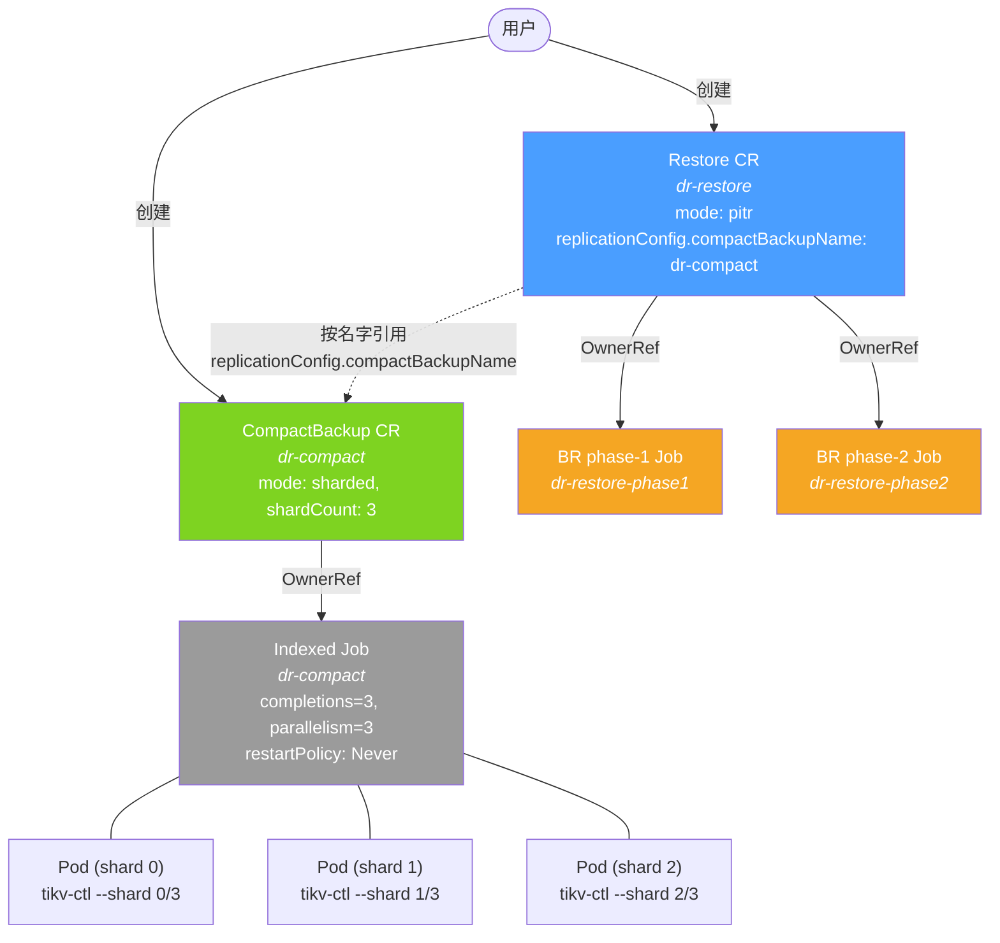
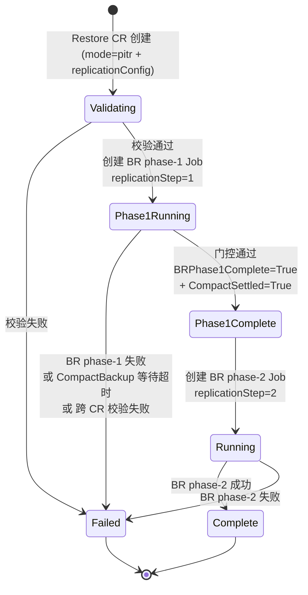
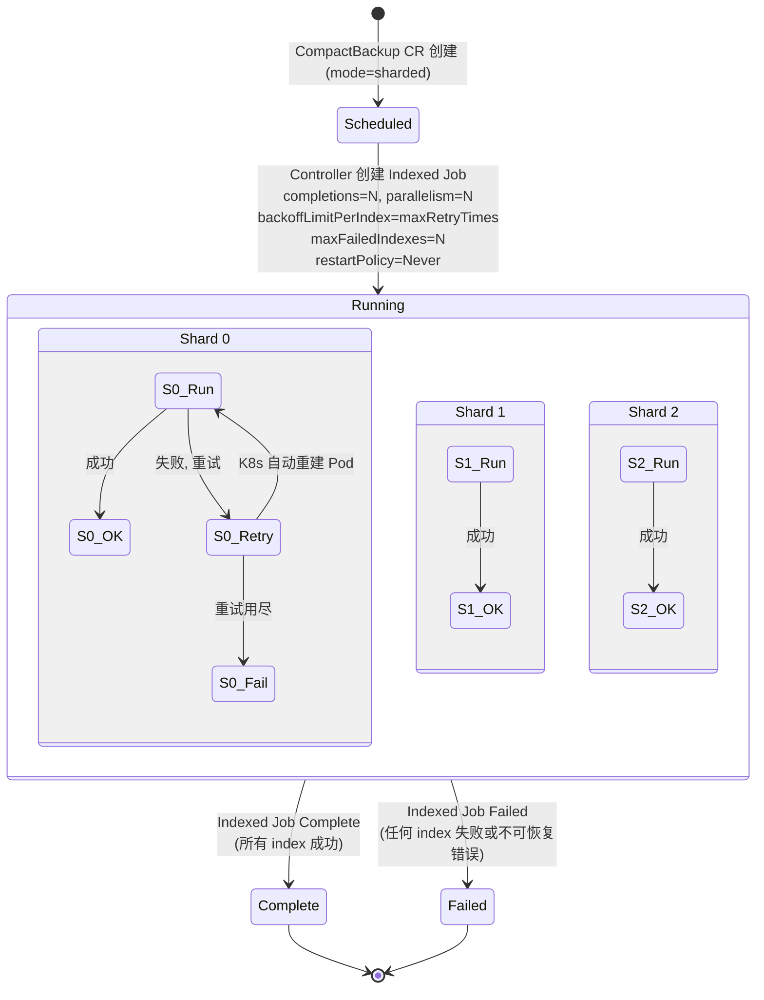
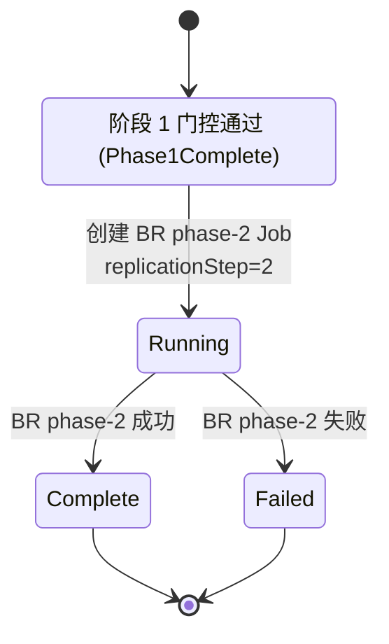
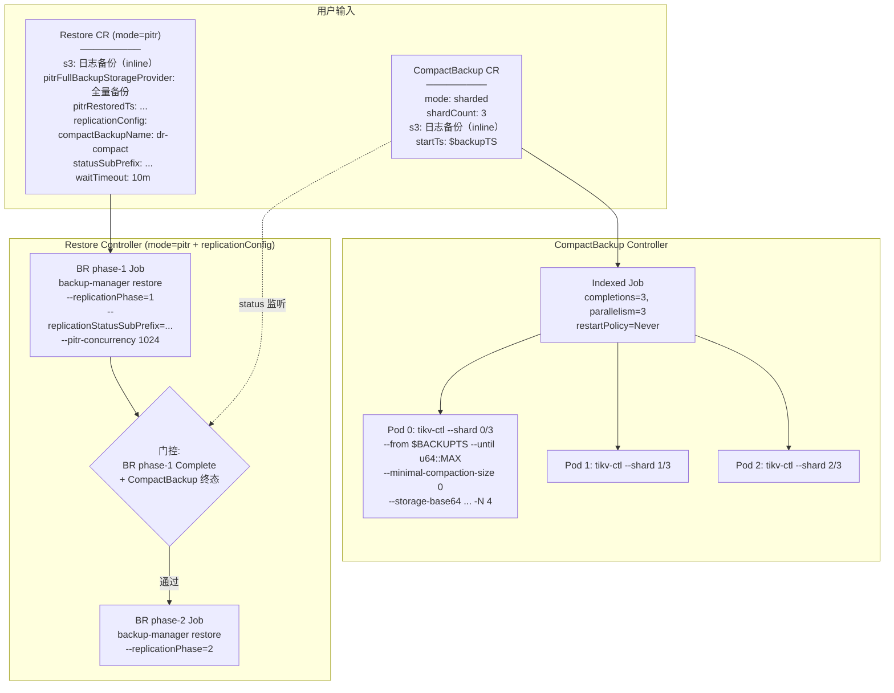
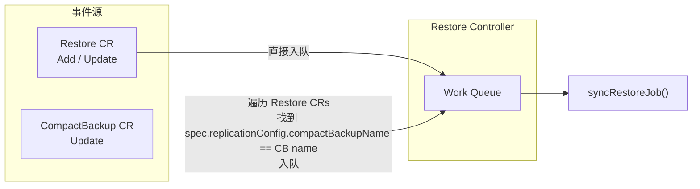

# Replication Restore: Operator 侧控制流设计 (v2)

## Summary

在跨 region 灾备场景下，复制上游的 log compaction 会产生额外的传输费用（相当于两份日志备份数据量）。为减少这份开销，将 log compaction 推迟到下游 PITR 恢复时执行，并通过多节点并行分片来控制恢复时间。

本提案**不引入新 CRD，也不引入新 RestoreMode**，而是复用现有的 `Restore` CR（PiTR 模式）和 `CompactBackup` CR：
- `CompactBackup` 扩展 `mode: sharded` 支持，通过 K8s Indexed Job 实现多节点并行分片 compaction
- `Restore` PiTR 模式新增可选的 `replicationConfig` struct，显式引用 CompactBackup CR
- Restore controller 在 replication 场景下管理 BR phase-1（断点设置）和 BR phase-2（日志恢复）两个 Job

## Motivation

### Goals

- 在 PITR 恢复时才执行 log compaction，避免跨 region 传输 compaction 后的数据
- 支持多节点并行分片 compaction（tikv-ctl `--shard n/N`），通过 K8s Indexed Job 原生能力实现
- compaction 与 BR phase-1（断点设置）并行执行
- compaction 任务全部到达终态后（无论成功或失败），继续执行 BR phase-2（日志恢复）

### Non-Goals

- 不引入新 CRD，不引入新 RestoreMode
- 不修改 BR 或 tikv-ctl 的内部实现（它们已支持所需参数）
- 不涉及上游 log compaction 的调度
- 不修改现有 PiTR、snapshot、volume-snapshot 模式的代码路径

## Proposal

### User Stories

#### Story 1: 执行跨 region 灾备恢复

用户分别创建 CompactBackup CR（分片 compaction）和 Restore CR（显式引用 CompactBackup），Operator 自动编排两阶段恢复流程。

```yaml
# Step 1: 创建 CompactBackup（mode=sharded，启用 Indexed Job 分片 compaction）
apiVersion: pingcap.com/v1alpha1
kind: CompactBackup
metadata:
  name: dr-compact
  namespace: tidb-cluster
spec:
  mode: sharded               # 显式声明分片模式
  shardCount: 3               # Indexed Job 3 个并行 Pod
  concurrency: 4              # 每个 shard 内部并发度 (-N)
  maxRetryTimes: 6
  br:
    cluster: downstream-cluster
    clusterNamespace: tidb-cluster
  s3:                         # StorageProvider (inline) — 日志备份存储
    bucket: log-backup-bucket
    region: us-west-2
    prefix: /log-backup
  startTs: "409054741514944513"  # 全量备份的 BackupTS（--from）
  endTs: "18446744073709551615"   # u64::MAX（--until，compact 到最新）
---
# Step 2: 创建 Restore（PiTR 模式 + replicationConfig 显式引用 CompactBackup）
apiVersion: pingcap.com/v1alpha1
kind: Restore
metadata:
  name: dr-restore
  namespace: tidb-cluster
spec:
  mode: pitr                   # 复用 PiTR 模式，不新增 mode
  br:
    cluster: downstream-cluster
    clusterNamespace: tidb-cluster
  s3:                          # StorageProvider (inline) — 日志备份存储（复用）
    bucket: log-backup-bucket
    region: us-west-2
    prefix: /log-backup
  pitrFullBackupStorageProvider:  # 复用：全量备份存储
    s3:
      bucket: full-backup-bucket
      region: us-west-2
      prefix: /full-backup
  pitrRestoredTs: "409054741514944513"   # 复用：恢复目标时间点
  replicationConfig:                     # 新增：replication-specific 配置
    compactBackupName: "dr-compact"      # 显式引用 CompactBackup CR 名
    statusSubPrefix: "crr-checkpoint"    # replication status 文件子路径前缀
    waitTimeout: "10m"                   # 等待 CompactBackup 出现的超时
```

#### Story 2: Compaction 全部失败但恢复继续

3 个 compaction shard 在重试用尽后全部失败。Indexed Job 终态为 `Failed`（任何 shard 失败都会导致整体 Failed），CompactBackup state 映射为 `Failed`。Restore 门控**只看 CompactBackup 是否到达终态**（Complete 或 Failed 都放行），因此门控通过，BR phase-2 正常启动。

#### Story 3: Compaction 仍在重试时阻塞

3 个 shard 中 1 个仍在重试中。Indexed Job 未到达终态，CompactBackup 保持 Running，Restore 等待。

### Risks and Mitigations

| 风险 | 缓解措施 |
|------|---------|
| BR phase-1 或 phase-2 Job 失败 | Restore 进入 Failed 状态，用户可检查 Job 日志 |
| 单个 compaction shard 长时间运行 | 阻塞 phase-2 但不影响其他 shard；可配置 maxRetryTimes |
| CompactBackup 新增 `mode` 字段影响现有使用 | mode 默认空值，走现有单 Job 模式 |
| K8s 版本要求 | Indexed Job 的 `backoffLimitPerIndex` 需要 K8s 1.29+（go.mod 中 k8s.io/api v0.29 是编译依赖，不等于运行时版本）；CompactBackup controller 创建 Indexed Job 前需做 server version check |
| 用户拼写 `compactBackupName` 错误 | `waitTimeout` 到期后 Restore 设为 Failed，防止无限等待 |

---

## Design Details

### 组件职责

| 组件 | 职责 |
|------|------|
| `tikv-ctl compact-log-backup --shard n/N --from ... --until 18446744073709551615 --minimal-compaction-size 0` | 按 store_id 哈希分片执行 log compaction |
| `br restore point --replication-storage-phase 1` | 读取 replication status 文件，提取 global checkpoint ts，设置断点并退出 |
| `br restore point --replication-storage-phase 2` | 读取 replication status 文件，检查断点，进入日志恢复 |
| `Restore Controller` | PiTR 模式下检测 `replicationConfig`：非空则创建两个 BR Job，监听 CompactBackup 状态做门控 |
| `CompactBackup Controller` | `mode=sharded` 时创建 Indexed Job（否则创建普通 Job），管理重试和状态追踪 |

### CRD 变更

**不新增 CRD、不新增 RestoreMode**。

#### Restore CR（扩展）

新增一个可选的 `ReplicationConfig` struct，复用现有 PiTR 字段（`storageProvider`、`pitrFullBackupStorageProvider`、`pitrRestoredTs`、`br`）：

```go
type RestoreSpec struct {
    // ... 现有字段全部保留 ...

    // +optional
    ReplicationConfig *ReplicationConfig `json:"replicationConfig,omitempty"`
}

type ReplicationConfig struct {
    CompactBackupName string             `json:"compactBackupName"`          // 必填
    StatusSubPrefix   string             `json:"statusSubPrefix"`            // 必填
    WaitTimeout       *metav1.Duration   `json:"waitTimeout,omitempty"`      // 可选，默认 0 表示无限等待
}
```

**触发规则**：`mode: pitr` 且 `replicationConfig != nil` → 走 replication restore 流程；`replicationConfig == nil` → 走标准 PiTR 流程（现有行为不变）。

**新增 RestoreConditionType**：

| 新增 Condition | 类别 | 含义 |
|----------------|------|------|
| `RestorePhase1Running` | Phase 值 | 阶段 1 进行中 |
| `RestorePhase1Complete` | Phase 值 | 门控通过，准备阶段 2 |
| `RestoreBRPhase1Complete` | Condition 标记 | BR phase-1 Job 成功完成（不改变 Phase） |
| `RestoreCompactSettled` | Condition 标记 | CompactBackup 到达终态（不改变 Phase） |

> Phase 值互斥驱动 `status.phase` 变化；Condition 标记并列记录在 conditions 列表中，Controller 检查标记组合判断门控。详见 [状态模型设计](2026-04-15-replication-restore-status-model.md#1-状态写入权)。

**新增 Status 字段**：

```go
type RestoreStatus struct {
    // ... 现有字段 ...
    ReplicationStep int32 `json:"replicationStep,omitempty"`  // 1 或 2，控制 Complete 转化
}
```

#### CompactBackup CR（扩展）

新增显式的 `mode` 字段区分单 Job 和 Indexed Job 行为：

```go
type CompactSpec struct {
    // ... 现有字段全部保留 ...

    // +optional
    Mode       CompactMode `json:"mode,omitempty"`        // "" (单 Job) 或 "sharded"
    // +optional
    ShardCount *int32      `json:"shardCount,omitempty"`  // mode=sharded 时必填
}

type CompactMode string
const (
    CompactModeDefault CompactMode = ""         // 现有单 Job 行为
    CompactModeSharded CompactMode = "sharded"  // 启用 Indexed Job
)
```

**新增 Status 字段**（仅 sharded 模式填充）：

```go
type CompactStatus struct {
    // ... 现有字段 ...
    CompletedIndexes string `json:"completedIndexes,omitempty"`  // 来自 Job.status.completedIndexes
    FailedIndexes    string `json:"failedIndexes,omitempty"`     // 来自 Job.status.failedIndexes
}
```

详见 [CRD 字段变更文档](2026-04-15-replication-restore-crd-changes.md)。

### 资源关系



- CompactBackup 和 Restore 是**独立的 CR**，无 OwnerReference 关系
- Restore controller 通过 `spec.replicationConfig.compactBackupName` 显式引用 CompactBackup（同 namespace）
- 两者可由用户同时创建，并行启动；支持 late binding（先创建 Restore 后创建 CompactBackup）
- **删除行为**：删除 Restore 时，两个 BR Job 通过 OwnerReference 被级联删除；CompactBackup 不会被级联删除（独立资源），其 Indexed Job 会继续运行，用户需手动清理

### 控制流

#### 整体状态机



> **Phase 值说明**：Phase-2 复用现有 `Running`/`Complete`/`Failed`（replicationStep=2 时不做转化），不引入新的 `Phase2Running` 类型。详见 [状态模型设计](2026-04-15-replication-restore-status-model.md#1-状态写入权)。

#### 阶段 1：BR 断点设置 + 分片 Log Compaction（并行）

Restore controller 创建 BR phase-1 Job，同时监听 `replicationConfig.compactBackupName` 指定的 CompactBackup 的状态。两者独立执行、独立管理。

```mermaid
stateDiagram-v2
    [*] --> Phase1Running: 创建 BR phase-1 Job<br/>开始监听 CompactBackup 状态

    state Phase1Running {
        state "BR phase-1 Job" as BR {
            BR_Running --> BR_Complete: Job 成功
            BR_Running --> BR_Failed: Job 失败
        }

        state "CompactBackup CR (独立管理)" as Compact {
            CB_Scheduled --> CB_Running: CompactBackup controller<br/>创建 Indexed Job
            CB_Running --> CB_Terminal: 所有 shard 到达终态<br/>(Complete 或 Failed)
        }
    }

    Phase1Running --> Failed: BR phase-1 失败

    state Gate <<choice>>
    Phase1Running --> Gate: BR Complete +<br/>CompactBackup 终态

    Gate --> Phase1Running: 条件未满足，等待
    Gate --> Phase2: 两个条件都满足
    state Phase2 as "进入阶段 2"
```

**门控条件**：

| 条件 | 判定方式 | 说明 |
|------|----------|------|
| BR phase-1 成功 | BR phase-1 Job condition == `Complete` | **必须成功**，失败则 Restore 失败 |
| CompactBackup 终态 | CompactBackup status.state ∈ {`Complete`, `Failed`} | 无论成功失败都放行 |

**CompactBackup 内部状态机**（Indexed Job 模式，CompactBackup controller 管理）：



关键设计：Indexed Job 设置 `maxFailedIndexes = shardCount`，作用是**不提前终止**——即使部分 shard 失败，其他 shard 继续运行直到全部跑完。最终 Job 终态为 Complete（全部成功）或 Failed（任何 shard 失败）。Restore 门控只看 CompactBackup 是否到达终态（Complete 或 Failed），不关心成败比。

#### 阶段 2：BR 日志恢复



**最终 Restore Status 示例（成功）**：
```yaml
status:
  phase: Complete
  replicationStep: 2
  conditions:
    - type: Scheduled
      status: "True"
    - type: Phase1Running
      status: "True"
    - type: BRPhase1Complete       # Condition 标记，不改变 Phase
      status: "True"
    - type: CompactSettled          # Condition 标记，不改变 Phase
      status: "True"
    - type: Phase1Complete
      status: "True"
    - type: Running
      status: "True"
    - type: Complete
      status: "True"
```

### 数据流



### Controller 事件监听

Restore controller 新增 CompactBackup informer：



当 CompactBackup 状态变化时，Restore controller 需要找到引用它的 Restore CR。实现方式：维护一个 `{ compactBackupName → [restoreName] }` 索引，或者简单遍历所有 Restore CR 按名字匹配（小规模场景可接受）。

### Restore Controller 内部：Handler 模式

Replication 场景的逻辑通过 Handler 模式与现有 mode（snapshot、pitr 标准、volume-snapshot）隔离，避免在多个方法中散布 if 分支。

**触发条件**：`restore.Spec.Mode == "pitr"` 且 `restore.Spec.ReplicationConfig != nil`。

详细设计见 [状态模型文档 Handler 模式章节](2026-04-15-replication-restore-status-model.md#2-双-job-对象模型)。

关键原则：
- 现有 mode 代码路径**完全不变**——拦截 if 只对 replication 场景生效，其他路径直接跳过
- Replication 场景的全部逻辑封装在 `replication_handler.go` 一个文件中
- 拦截点放在通用校验之后、mode 分支之前，确保通用校验不被跳过

### CompactBackup Indexed Job 配置

当 `spec.mode == "sharded"` 时，CompactBackup controller 创建 Indexed Job：

| Job Spec 字段 | 值 | 说明 |
|---------------|-----|------|
| `completionMode` | `Indexed` | 启用索引模式 |
| `completions` | `spec.shardCount` | 总分片数 |
| `parallelism` | `spec.shardCount` | 全部并行 |
| `backoffLimitPerIndex` | `spec.maxRetryTimes` | 每个 shard 独立重试上限 |
| `maxFailedIndexes` | `spec.shardCount` | 不提前终止，让所有 shard 都跑完 |
| `restartPolicy` | `Never` | `backoffLimitPerIndex` 硬性要求 |

每个 Pod 自动获得环境变量 `JOB_COMPLETION_INDEX`，backup-manager compact 命令读取该变量作为 `--shard` 参数的 index。

### Test Plan

**单元测试**：
- Restore controller replication 场景状态机转换
- CompactBackup Indexed Job 创建逻辑
- 门控条件判定（BR phase-1 Complete + CompactBackup 终态）
- `UpdateRestoreCondition()` 的 Complete 转化逻辑（replicationStep=1 vs 2）

**集成测试场景**：

| 场景 | 预期结果 |
|------|----------|
| BR phase-1 成功 + CompactBackup Complete | BR phase-2 启动 → Restore Complete |
| BR phase-1 成功 + CompactBackup Failed（全部 shard 失败） | BR phase-2 仍启动 → Restore Complete |
| BR phase-1 成功 + CompactBackup Running | Restore 等待 |
| BR phase-1 失败 | Restore Failed（不等 CompactBackup） |
| BR phase-2 失败 | Restore Failed |
| `compactBackupName` 拼写错误 + waitTimeout 到期 | Restore Failed, reason: CompactBackupWaitTimeout |
| 跨 CR 存储/集群配置不一致 | Restore Failed, reason: CompactBackupMismatch |

---

## Drawbacks

- Restore controller 新增了 replication 场景的分支逻辑和 CompactBackup informer
- 用户需要分别创建两个 CR（CompactBackup + Restore），操作步骤多于单 CRD 方案
- `replicationConfig.compactBackupName` 是跨 CR 的名字引用，用户需要手动保证名字正确（通过 waitTimeout 做兜底）

## Alternatives

### 方案 1: 新建 ReplicationRestore CRD

引入独立的 `ReplicationRestore` CRD 和 controller，自动编排全流程。

**被否决原因**：团队会议决定不引入新 CRD，复用现有 CR 降低系统复杂度。

### 方案 2: 每个 shard 一个 CompactBackup CR

创建 N 个 CompactBackup CR，每个管理一个 shard。

**被否决原因**：Indexed Job 是更好的方式——单个 Job 管理 N 个 Pod，K8s 原生支持 per-index 重试和并行度控制，资源数量从 N 个 CR + N 个 Job 降为 1 个 CR + 1 个 Job。

### 方案 3: 新增 RestoreMode `replication`

新增一个 `restoreMode: replication` 区分 replication 和标准 PiTR。

**被否决原因**：replication restore 本质上就是 PiTR + compaction 等待，用 `replicationConfig` 可选 struct 更简洁，可以复用 PiTR 的所有现有字段（`pitrFullBackupStorageProvider`、`pitrRestoredTs` 等），不重复定义。

### 方案 4: Label 绑定 CompactBackup ↔ Restore

CompactBackup 上打 label 反向发现 Restore，不在 Restore spec 中引用。

**被否决原因**：隐式绑定不利于用户理解依赖关系，显式 `compactBackupName` 更符合 K8s 社区习惯（类似 Service selector 但方向明确）。

## Open Questions

1. **BackupTS 的来源**：当前 CompactBackup 的 `startTs` 由用户手动提供（从全量备份 backupmeta 中 EndVersion 导出）。内核侧提议未来由 operator 自动从全量备份存储解析（`EndVersion - 1`），此项**暂缓实现**，后续单独讨论。

## Resolved Questions

1. **`--until` 参数**：固定值 `18446744073709551615`（u64::MAX）。

2. **`--minimal-compaction-size` 参数**：固定值 `0`（硬编码）。

3. **`--pitr-concurrency` 参数**：固定值 `1024`（硬编码）。

4. **`--checkpoint-storage` 参数**：暂不支持。

5. **状态写入权和 Phase 模型**：通过 `RestoreStatus.ReplicationStep` 字段 + `UpdateRestoreCondition()` 转化层解决。backup-manager 零改动，照常写 Running/Complete/Failed；当 replicationStep=1 时，**只有 Complete 被转化为 BRPhase1Complete**（Condition 标记，不改变 Phase），Failed 不转化（直接作为整体终态，通过 Reason 区分失败原因）。详见 [状态模型设计](2026-04-15-replication-restore-status-model.md#1-状态写入权)。

6. **双 Job 对象模型**：Replication 场景通过 Handler 接管 Job 管理，不走 `GetRestoreJobName()`。Controller 重启后通过 `status.phase` 恢复阶段位置。详见 [双 Job 模型](2026-04-15-replication-restore-status-model.md#2-双-job-对象模型)。

7. **CompactBackup 绑定契约**：通过 `spec.replicationConfig.compactBackupName` 显式名字引用。同 namespace、支持 late binding、支持多 Restore 引用同一 CompactBackup、`waitTimeout` 兜底拼写错误。详见 [绑定契约](2026-04-15-replication-restore-status-model.md#3-compactbackup-绑定契约)。

8. **CompactBackup 部分失败语义**：`maxFailedIndexes = shardCount` 保证所有 shard 都跑完（不提前终止），但只要有任何 shard 失败，CompactBackup 终态为 `Failed`（全部成功才是 `Complete`）。成败统计通过 `completedIndexes` / `failedIndexes` 字段暴露。Restore 门控只看 CompactBackup 是否到达终态（Complete 或 Failed），不关心成败比。详见 [部分失败语义](2026-04-15-replication-restore-status-model.md#4-compactbackup-部分失败语义)。

9. **Indexed Job 运行前提**：运行时集群需要 K8s 1.29+。shard index 通过 `JOB_COMPLETION_INDEX` 环境变量传递。Pod `restartPolicy` 必须为 `Never`（backoffLimitPerIndex 要求）。详见 [传参链路](2026-04-15-replication-restore-status-model.md#5-indexed-job-运行前提和-shard-传参链路)。
