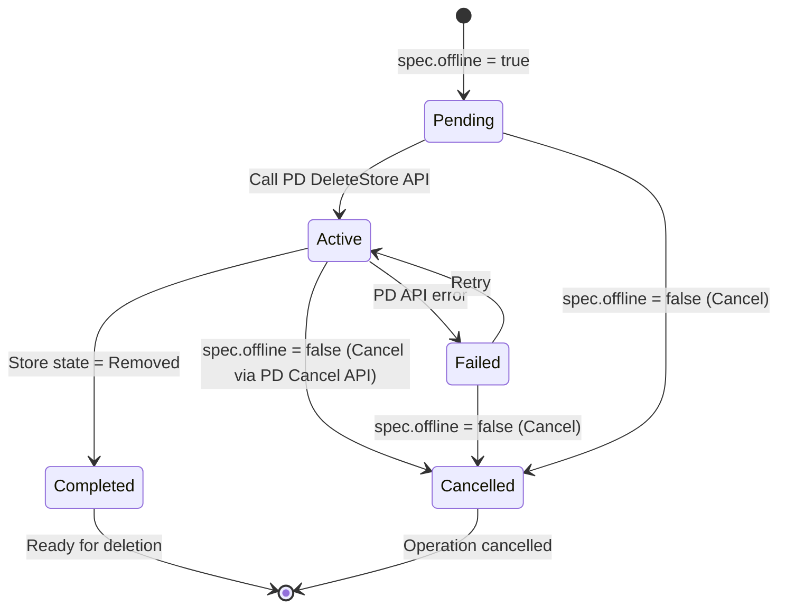
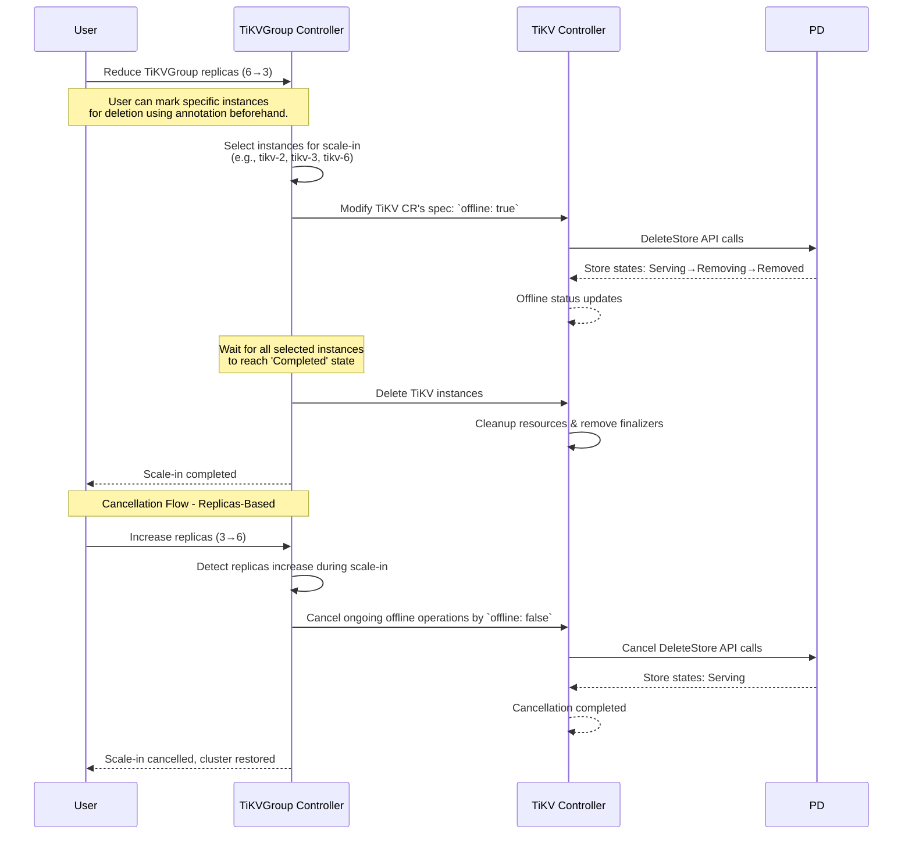
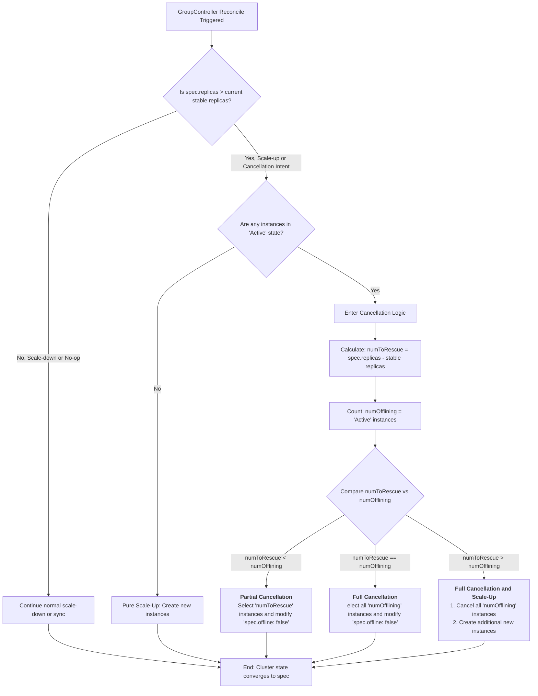

# Two-Step Store Deletion

<!-- toc -->
- [Release Signoff Checklist](#release-signoff-checklist)
- [Summary](#summary)
- [Motivation](#motivation)
  - [Goals](#goals)
  - [Non-Goals](#non-goals)
- [Proposal](#proposal)
  - [User Stories (Optional)](#user-stories-optional)
    - [Story 1](#story-1)
    - [Story 2](#story-2)
  - [Risks and Mitigations](#risks-and-mitigations)
- [Design Details](#design-details)
  - [Current Implementation Analysis](#current-implementation-analysis)
  - [Proposed Solution](#proposed-solution)
    - [Overview](#overview)
    - [API Changes](#api-changes)
      - [Instance Selection Annotation](#instance-selection-annotation)
      - [Instance's Spec and Status Addition](#instances-spec-and-status-addition)
    - [Controller Logic Changes](#controller-logic-changes)
      - [Group Controller](#group-controller)
      - [Instance Controller](#instance-controller)
      - [Backwards Compatibility](#backwards-compatibility)
  - [Test Plan](#test-plan)
    - [Unit Tests](#unit-tests)
    - [E2E Tests](#e2e-tests)
- [Drawbacks](#drawbacks)
- [Alternatives](#alternatives)
<!-- /toc -->

## Release Signoff Checklist

Items marked with (R) are required *prior to targeting to a release*.

- [ ] (R) This design doc has been discussed and approved
- [ ] (R) Test plan is in place
  - [ ] (R) e2e tests in kind
- [ ] (R) Graduation criteria is in place if required
- [ ] (R) User-facing documentation has been created in [pingcap/docs-tidb-operator]

## Summary

This RFC proposes a two-step store deletion process for TiKV/TiFlash scale-in operations in TiDB Operator v2. The design separates the offline operation from the actual deletion, providing users with control to cancel ongoing scale-in operations and select specific instances for deletion.

## Motivation

Currently, when scaling in TiKV/TiFlash, TiDB Operator v2 marks TiKV/TiFlash CRs as deleting and immediately starts the store deletion process. This approach has several limitations:
- Difficult to predict whether deletion will impact TiDB service
- Store deletion can take a very long time depending on data volume
- Once deletion starts, it cannot be cancelled

### Goals

- Allow users to cancel TiKV/TiFlash scale-in operations before the store is permanently removed
- Allow users to select instances to be deleted when scaling in
- Give users clear insight into the offline process progress
- Ensure existing workflows continue to work without modification

### Non-Goals

- This design does not aim to optimize PD's data rebalancing algorithms
- This design only focuses on TiKV/TiFlash deletion

## Proposal

The proposed solution introduces a two-step deletion process that separates the offline operation from the actual deletion, providing users with control and visibility throughout the process.

There will be two phases for store deletion:
- **Phase 1: Mark Store as Offline (Reversible)**
  - User optionally marks specific instances for deletion and reduces Group replicas
  - The group controller identifies which instances to scale in
  - The group controller marks selected instances with `spec.offline: true`
  - The instance controller calls PD DeleteStore API to begin data migration
  - Store enters "Removing" state in PD and data migration begins
  - Cancellable: Users can increase replicas to cancel ongoing scale-in operations
- **Phase 2: Delete Removed Store (Irreversible)**
  - Only proceed when store state is "Removed" in PD
  - The group controller deletes the TiKV/TiFlash instances
  - The instance controller validates the store is ready for deletion and proceed

### User Stories (Optional)

#### Story 1

As a TiDB cluster operator, I want to scale in TiKV nodes from 6 to 3 replicas, but realize during the data migration that this will impact performance. I want to cancel the scale-in operation by increasing replicas back to 6, restoring all nodes to their original online state.

#### Story 2

As a TiDB cluster operator, I want to select specific TiKV instances for deletion during scale-in operations. I can annotate the target instances with a special annotation before reducing the replicas, ensuring that the system prioritizes these instances for removal.

### Risks and Mitigations

- **Risk**: Cancellation during active data migration may leave stores in inconsistent state
  - **Mitigation**: Implement proper PD API calls to cleanly cancel store deletion and return stores to online state
- **Risk**: Complex state management may introduce bugs in the controller logic
  - **Mitigation**: Implement comprehensive unit tests and e2e tests covering all state transitions

## Design Details

### Current Implementation Analysis

Current Store Deletion Flow:
1. User modifies the replicas to scale in TiKV/TiFlash
2. The group controller deletes instance CRs
3. The instance controller calls PD DeleteStore API
4. The store is marked as Offline in PD
5. The instance controller deletes Subresources(PVC, ConfigMap, etc.) when store state is Removed

As we can see, in the second step the instance CR will be added a DeletionTimestamp, which makes it's impossible to cancel.

### Proposed Solution

#### Overview

The proposed solution introduces a two-step deletion process that separates the offline operation from the actual deletion, providing users with control and visibility throughout the process.

There will be two phases for store deletion:
- Phase 1: Mark Store as Offline (Reversible)
  - User optionally marks specific instances for deletion and reduces Group replicas
  - The group controller identifies which instances to scale in
  - The group controller marks selected instances with spec.offline: true
  - The instance controller calls PD DeleteStore API to begin data migration
  - Store enters "Removing" state in PD and data migration begins
  - Cancellable: Users can increase replicas to cancel ongoing scale-in operations, the group controller will modify instances with spec.offline: false
- Phase 2: Delete Removed Store (Irreversible)
  - Only proceed when store state is "Removed" in PD
  - The group controller deletes the TiKV/TiFlash instances
  - The instance controller validates the store is ready for deletion and proceed

#### API Changes

##### Instance Selection Annotation

We can use a fixed annotation to mark TiKV/TiFlash instances for deletion: `pingcap.com/offline-store`.

When users want to specify which instances to delete during scale-in:
1. Add this annotation to target instances
2. Reduce the replicas of a component group CR
3. The group controller prioritizes annotated instances for selection
4. Falls back to default selection if needed

##### Instance's Spec and Status Addition

Take TiKV for example:

```go
type TiKVSpec struct {
    // ... existing fields ...
    
    // Offline marks the store as offline in PD to begin data migration.
    // When true, the store will be marked as offline in PD.
    // When false, the store will be marked as online in PD (if possible).
    // +optional
    Offline bool `json:"offline,omitempty"`
}

// We will introduce a new condition type to track the offline process.
const (
    // StoreOfflineConditionType represents the condition of the store offline process.
    StoreOfflineConditionType = "Offlining"
)

// Reasons for the StoreOfflineConditionType condition.
const (
    // OfflineReasonPending means the offline operation is requested but not yet started.
    OfflineReasonPending = "Pending"
    // OfflineReasonActive means the store is being offlined.
    OfflineReasonActive = "Active"
    // OfflineReasonCompleted means the store has been successfully offlined and removed from PD.
    OfflineReasonCompleted = "Completed"
    // OfflineReasonFailed means the offline operation failed.
    OfflineReasonFailed = "Failed"
    // OfflineReasonCancelled means the offline operation was cancelled.
    OfflineReasonCancelled = "Cancelled"
)
```

The offline operation follows this state machine:



#### Controller Logic Changes



Here is an example Flow:
- Step 1: User sets replicas 6→3
  - Group Controller selects tikv-2, tikv-3, tikv-6 for deletion
  - Begins offline operations
- Step 2: User sets replicas 3→5 (cancellation)
  - Group Controller detects need for 5 instances (keep 2 of the 3 being deleted)
  - Cancels offline operations for tikv-2, tikv-3 (keeping tikv-6 offline)
  - tikv-2, tikv-3 return to online state
  - tikv-6 continues offline process (still scaling 6→5)
- Step 3: User sets replicas 5→6 (full cancellation)
  - Group Controller cancels remaining offline operation for tikv-6
  - All instances return to online state

##### Group Controller

The group controller will implement a clean cancellation mechanism based on replicas changes.

###### Scale-In Detection

- When `spec.replicas` decreases, initiate scale-in operation
- Select instances with deletion annotation first, then use default selection
- Set `spec.offline: true` for selected instances
- Track offline progress in instance status

###### Cancellation Detection



##### Instance Controller

- Add a task for the TiKV/TiFlash instance to handle offline operations
- Modify the finalizer task to require offline before deletion
- Implement the state machine for offline phases
- Add calls to PD to cancel delete store

##### Backwards Compatibility

The design maintains backwards compatibility through:
1. **Optional Field**: `spec.offline` field is optional
2. **Existing Behavior**: Instances without `spec.offline` work as before

### Test Plan

#### Unit Tests

- **Selection strategy tests**
  - Test annotation-based selection
  - Test fallback selection strategies
  - Test health-aware selection
- **Offline operation state transitions**
  - Test state machine transitions for all phases
  - Test PD API interaction and error handling
  - Test cancellation at different phases
- **Cancel logic tests**
- **Edge case tests**
  - Cancel during "Pending" phase (should always succeed)
  - Cancel during "Active" phase (should succeed if PD supports cancellation)
  - Cancel during "Completed" phase (should fail - already completed)
  - Cancel during "Failed" phase (should succeed)
  - Multiple rapid cancel/retry operations
  - PD API errors during cancel operations

#### E2E Tests

- **Complete scale-in flow**
  1. Scale in from 3 to 1 replicas
  2. Verify offline operations progress and status
  3. Verify final deletion and cleanup
- **Cancellation workflow**
  1. Annotate two TiKV instances for deletion
  2. Scale in TiKVGroup from 3 to 1 replicas
  3. Verify offline operations progress and status
  4. Cancel by increasing replicas to 3
  5. Verify stores return to online state

## Drawbacks

- **Increased complexity**: The two-step process adds complexity to the controller logic and state management
- **Additional API surface**: New fields and conditions increase the API surface area
- **Learning curve**: Users need to understand the new offline/online concept and state transitions

## Alternatives

1. **Single-step deletion with pre-validation**: Add validation checks before deletion but keep the current single-step approach
   - **Rejected**: Still doesn't allow cancellation once deletion starts
   
2. **External annotation-based control**: Use annotations to control deletion flow instead of spec fields
   - **Rejected**: Annotations are less discoverable and harder to validate

3. **Separate CRD for deletion operations**: Create a dedicated CRD to manage deletion operations
   - **Rejected**: Adds unnecessary complexity and additional resources to manage
